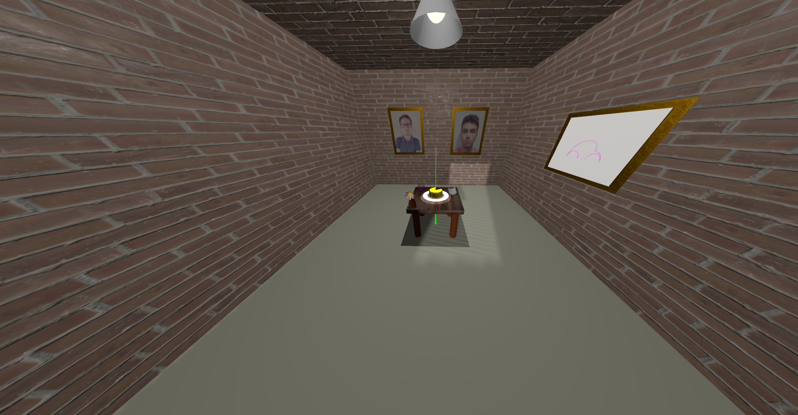
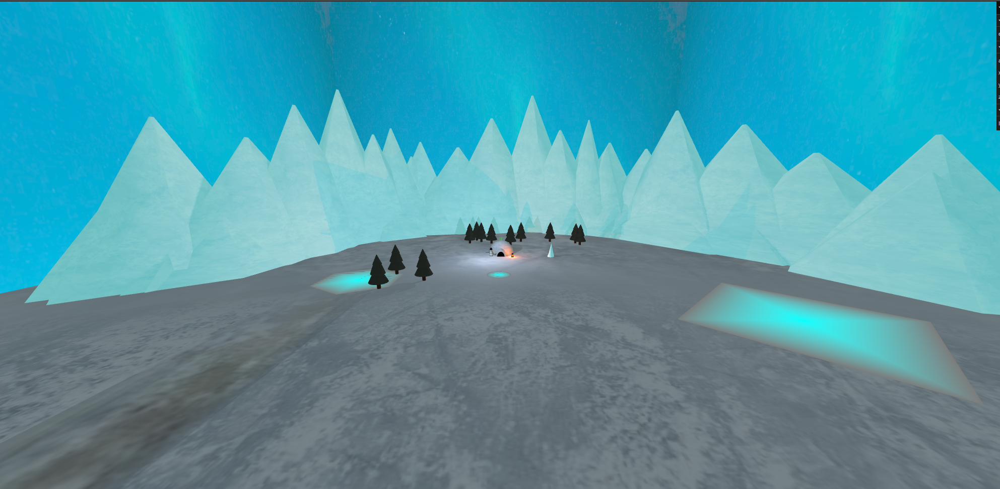

# SGI 2023/2024

## Group T03G01
| Name             | Number    | E-Mail             |
| ---------------- | --------- | ------------------ |
| Pedro Pereira Ferreira         | 202004986 | up202004986@edu.fe.up.pt                |
| Lourenço Alexandre Correia Gonçalves         | 202004816 | up202004816@edu.fe.up.pt                |

----

## Projects

### [TP1 - ThreeJS Basics](tp1)

- The goal of this project, was to understand the basics of the THREE.js. This includes to know how to do the following:
  - How to create the most importante elements (scene, camreras, lights, geometries, materials, meshes, etc);
  - What are the most important properties of each element (geometry, materials and meshes);
  - How to do the basic transformations (translation, rotation, scale);
  - How to do use different types of cameras (perspective and orthographic);
  - How to use different types of lights (ambient, directional, point, spot);
  - How to use textures and apply them to the materials;
  - How to create different types of curves and surfaces;
  - How to use shadows;

  - This can be visualized in detail [here](./tp1/README.md).

- Scene
  - Our inspiration to create the scene was a dark pink room of Louvre Museum. As a result we chose the colors according to it, with the difference that our room has a window in a wall.

  - Besides that, we needed to add a table which has a newspaper, a jar with a flower, a cake with a candle in a plate and a spring, all upon it.

  - We also did the Beetle silhouette and put it in a painting on the wall.

  - Finally, the shadows of the objects in the scene, as well as other light sources.

- Here is the link for the scene: 
[!Scene]http://127.0.0.1:5500/tp1/
-----

### [TP2 - Development of a 3D graphics application](tp2)

The aim of this work is to create an application equipped with a small 3D graphics engine, provided by the teachers.

Our scene consists in  consists in an igloo, a snowman and a lamp in the middle of an arctic tundra. In a second plane, we have a mountain range and a sky with the aurora.

- The first strong point is the skybox with the aurora borealis. We used a cube (6 planes) with a video texture of the aurora borealis.

- The other strong point is the snowman. We used 3 spheres: 1 for the head and the others for the body. We also used a orange cylinder for the nose with an carrot texture, 2 black spheres for the eyes and 6 black spheres for the body's dots. We also used 2 black cylinders for the hat. Besides that, we used a cone 2 cylinders for the arms and a plane with a "Welcome" signal texture.

- The igloo is composed by 2 parts: the dome and the tunnel. The base is a half of sphere with a snow brick texture and the tunnel 2 half of cylinders, one with the same snow brick texture and the other with a black material, to simulate the entrance.

- The lamp is composed by many materials: a cylinder with 4 clices for the base, another 4 cylinders with more slices for the supports, a boxes for the base and top, a strecthed sphere with a ambar material for the lamp with a pointlight in it. The cylinders and box have a metal texture.

- The ice floor is composed with an ice texture and several mipmaps levels, to reduce the quality of the texture in the distance.

- The mountain range is composed by mountains, all of them with an ice texture.

- The lakes were made with polygons (buffer geometries), placed in front of the igloo.

- The forest was composed by a group of trees. Each tree is composed by a trunk and a crown, which were wireframe objects. 

- The scene can be visualized in detail.

Scene: http://127.0.0.1:5500/tp2/.

----

### [TP3 - ...](tp3)
- (items briefly describing main strong points)

