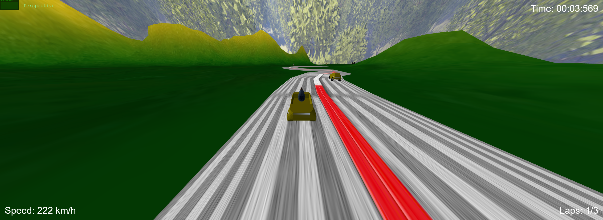

# SGI 2023/2024 - TP3

## Group T03G01
| Name             | Number    | E-Mail             |
| ---------------- | --------- | ------------------ |
| Pedro Pereira Ferreira         | 202004986 | up202004986@edu.fe.up.pt                |
| Lourenço Alexandre Correia Gonçalves         | 202004816 | up202004816@edu.fe.up.pt                |

----
## Project information

- We had to develop a PvB racing videogame. We called it the Formula 0.5

## Strong points

- The logical of the game is well implemented, since we can go from the initial menu to the last one smoothly;

- The power-ups and obstacles' effects are well implemented, the user can see their influence during the race;

- The essential information, such as time elapsed, speed and laps completed are visible to the user.

- The user can use different cars, which shows some variety of the game elements. However, none of them is more advantageous than the other.

## Scene

- We created 5 scenes: the initial menu, the car selection (one for the player and another for the bot), the race itself and the final scene.

- The initial scene consists of the display of game title, authors, and text input to the user insert their name, using spritesheets.

- After inserting their name, the user can select between 2 cars: the Renô Pingu and the prototype Renô R4.5.

- Player can choose the car they will race against with and select between 2 modes: easy and hard.

- After the choice of cars, the game redirects to the game scene, which contains a race track which has inspired the conception of the famous Monza Formula 1's circuit. The user will find several power-ups and obstacles in the race.

- Finally, we had a final scene, which informs the user if they has won of lost the race. If the user wins, some fireworks will appear.

[Link to the scene](http://127.0.0.1:5500/)

----

## Issues/Problems

- Spritesheet character offset bugged;
- Button clicks only work on the letters;
- Click to place obstacle not implemented;
- Power-ups don't go to the pause scene.
- Extra buttons, such as "Restart" and "Home", are not well implemented.
- HUD text has no relief.